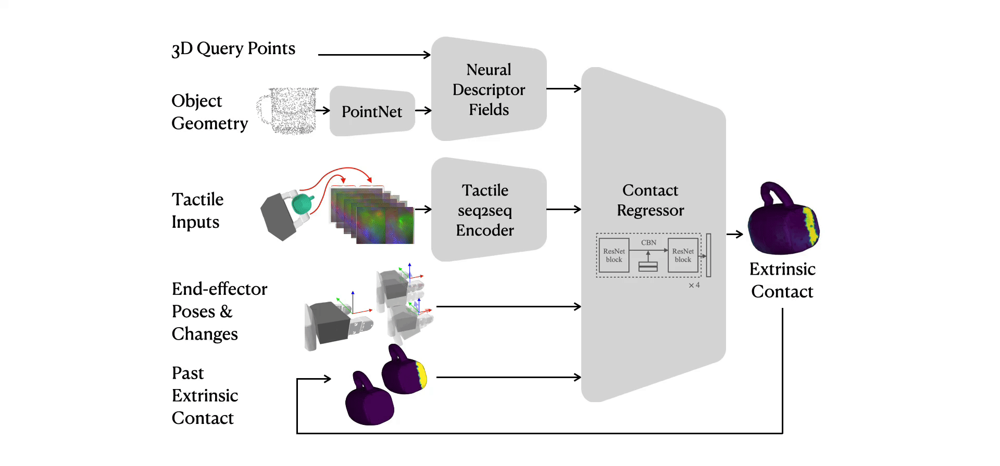

<h1 align="center">
  NCF-Policy
</h1>
<h2 align="center">
  Perceiving Extrinsic Contacts from Touch Improves Learning Insertion Policies
</h2>

<div align="center">
  <a href="https://carolinahiguera.github.io/">Carolina Higuera</a> &nbsp;•&nbsp;
  <a href="https://joeaortiz.github.io/">Joseph Ortiz</a> &nbsp;•&nbsp;
  <a href="https://haozhi.io/">Haozhi Qi</a> &nbsp;•&nbsp;
  <a href="https://scholar.google.com/citations?user=rebEn8oAAAAJ&hl=en">Luis Pineda</a> &nbsp;&nbsp; <br/>
  <a href="https://homes.cs.washington.edu/~bboots/">Byron Boots</a> &nbsp;•&nbsp;
  <a href="https://www.mustafamukadam.com/">Mustafa Mukadam</a>
  <br/>
  <br/>
</div>


<p align="center">
    <a href="https://arxiv.org/abs/2309.16652">Paper</a> |
    <a href="https://youtu.be/rG_xIfQ6-_k">Video</a>
</p>

Prior work on Neural Contact Fields (NCF) use *intrinsic* tactile sensing between gripper and object to estimate *extrinsic* contacts in simulation. However, its effectiveness and utility in real-world tasks remains unknown.

In this work, we improve NCF to enable sim-to-real transfer and use it to train policies for mug-in-cupholder and bowl-in-dishrack insertion tasks.

<p align="center">

</p>

-----
## NCF-v2 sim-to-real
Our work builds on Neural Contact Fields [(NCF-v1)](https://github.com/carolinahiguera/NCF) and improves it on several fronts to enable sim-to-real transfer.

Our NCF-v2 is able to track extrinsic contacts from touch, generalizing to unseen shapes and environments.
<p align="center">

</p>

-----
## Is estimating extrinsic contacts useful for manipulation policies?
We explore the effectiveness of estimating extrinsic contacts in downstream tasks of mug-in-cupholder and bowl-in-dishrack, which involve contact-rich interactions between object and environment. 

<p align="center">

</p>


-----
## Setup conda environment

We recommend using a conda environment to install the dependencies. You can create a new environment with the following command:

```bash
conda create -n ncf python=3.8
conda activate ncf
```

Download the Isaac Gym Preview 4 release from this [link](https://drive.google.com/file/d/1tSrDDJ6_JYNUrmZHPn55UaEgg-7mje04/view?usp=drive_link). Then, install it with the following command:

```bash
cd IsaacGym_Preview_4_Package/isaacgym/python # Go to the python folder of the Isaac Gym package
pip install -e .
```

Install TACTO from this repository [link](https://github.com/suddhu/tacto)

```bash
cd tacto # Go to the tacto folder
pip install -r requirements/requirements.txt
pip install -e .
pip install numpy==1.23 # TACTO requires numpy 1.23
```

Install additional dependencies:
```bash
pip install submitit
pip install pytorch-lightning
pip install open3d
pip install trimesh
pip install vedo
```

Install this repo:

```bash
cd NCF_policies
pip install -e .
```
-----

## NCF-v2
We made modifications to key componentes on the NCF pipeline to enable sim2real transfer. 

<p align="center">

</p>

You can find the code of NCF-v2 in:

```bash
NCF-policy/
    algo2/
    ncf/
        vae/
        ndf/
        contact_regressor/
        pipeline.py
```
For data generation and training procedures, you can follow the same steps for [(NCF-v1)](https://github.com/carolinahiguera/NCF).

-----

## Visualize and evaluate policies with/without extrinsic contacts in simulation
1. Download the checkpoints for NCF_v2 and the trained policies
    ```bash
    . download_checkpoints.sh
    ```
2. Edit in `run_test_cupholder.sh` or `run_test_dishrack.sh` the path to the checkpoint of the policy you want to evaluate.

    These files are located in `NCF_policies/isaacgymenvs/run_test_cupholder.sh` and `NCF_policies/isaacgymenvs/run_test_dishrack.sh`

3. To run a policy for the mug-in-cupholder task:

    ```bash
    NCF_policies/isaacgymenvs/run_test_cupholder.sh <GPU ID> <SEED> <FOLDER NAME> POLICY NAME>
    ```

    For example, for testing the policy with ground truth extrinsic contacts:

    ```bash
    NCF_policies/isaacgymenvs/run_test_cupholder.sh 0 42 v1 proprio_gt
    ```

    Testing the policy with proprioception + ncf:
    ```bash
    NCF_policies/isaacgymenvs/run_test_cupholder.sh 0 42 v1 proprio_ncf
    ```

    Testing the policy with proprioception + tactile:
    ```bash
    NCF_policies/isaacgymenvs/run_test_cupholder.sh 0 42 v1 tactile
    ```

    Testing the policy with proprioception only:
    ```bash
    NCF_policies/isaacgymenvs/run_test_cupholder.sh 0 42 v1 proprio
    ```

3. Similarly, for testing a policy on the bowl-in-dishrack task:

    ```bash
    NCF_policies/isaacgymenvs/run_test_dishrack.sh <GPU ID> <SEED> <FOLDER NAME> POLICY NAME>
    ```

## Citing
If you find NCF-v2 or this codebase helpful in your research, please consider citing:
```bash
misc{higuera2023perceiving,
      title={Perceiving Extrinsic Contacts from Touch Improves Learning Insertion Policies}, 
      author={Carolina Higuera and Joseph Ortiz and Haozhi Qi and Luis Pineda and Byron Boots and Mustafa Mukadam},
      year={2023},
      eprint={2309.16652},
      archivePrefix={arXiv},
      primaryClass={cs.RO}
}
```

## License
The majority of NCF-v2 is licensed under MIT license, however portions of the project are available under separate license terms. Pytorch-lightning is under Apache License 2.0. IsaacGymEnvs is licensed under the BSD 3-clause license.  See [LICENSE](https://github.com/carolinahiguera/NCF-Policy/blob/main/LICENSE) for details.

## Acknowledgements

We use the implementation provided in the [neural descriptor fields repo](https://github.com/anthonysimeonov/ndf_robot). For implementing the insertion tasks, we use as reference the Factory environments available in the [IsaacGymEnvs](https://github.com/NVIDIA-Omniverse/IsaacGymEnvs/tree/main) repo. As for the RL method, we use the PPO implementation available in the codebase of the [Hora](https://github.com/HaozhiQi/hora) project. 

For TACTO intergration, we reference from the [Hora-Tactile](https://haozhi.io/rotateit/) and [MidasTouch](https://github.com/facebookresearch/MidasTouch) projects.

We encourage you to check out all these projects!
